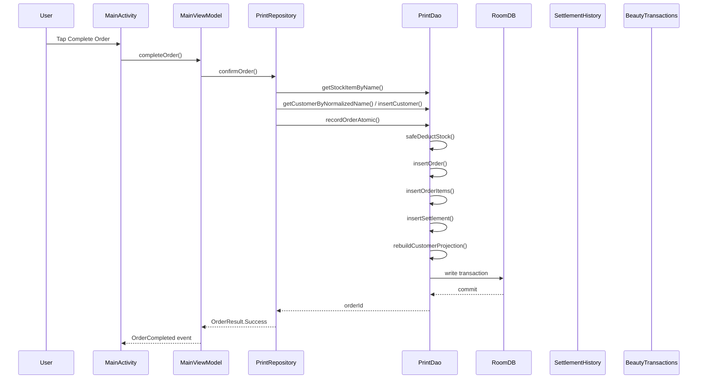
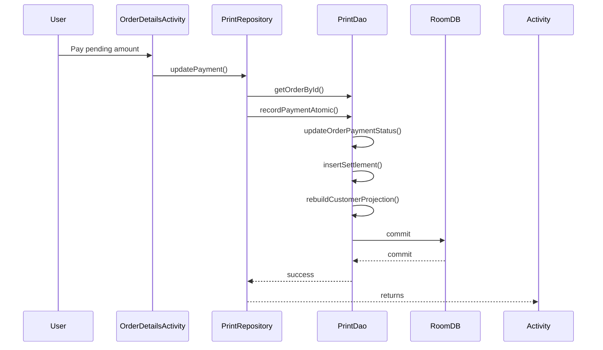
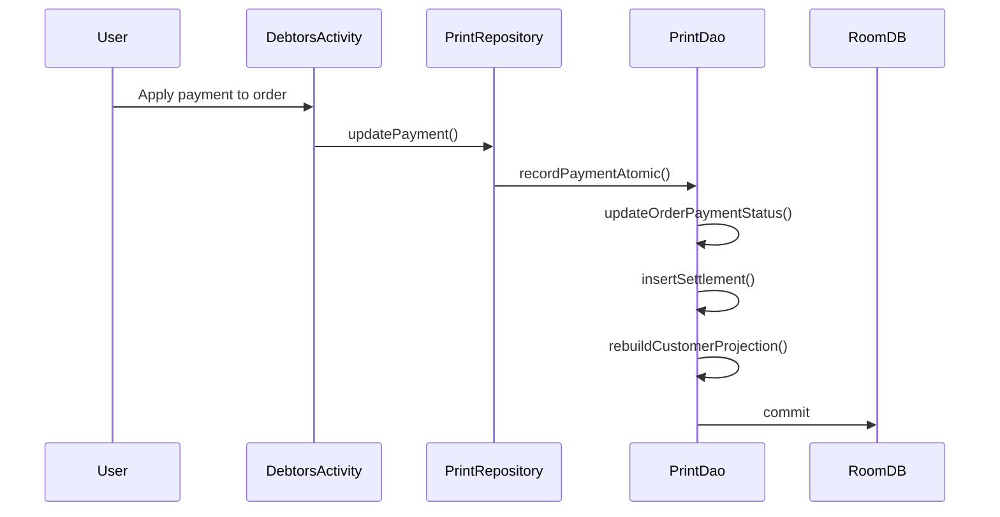
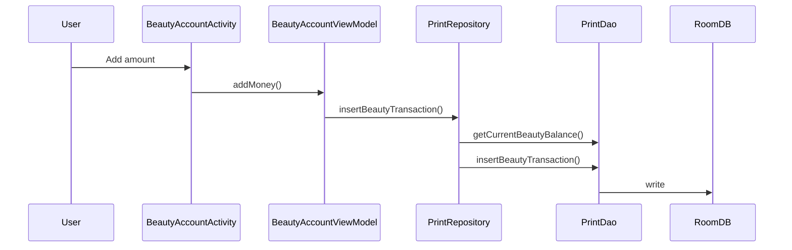
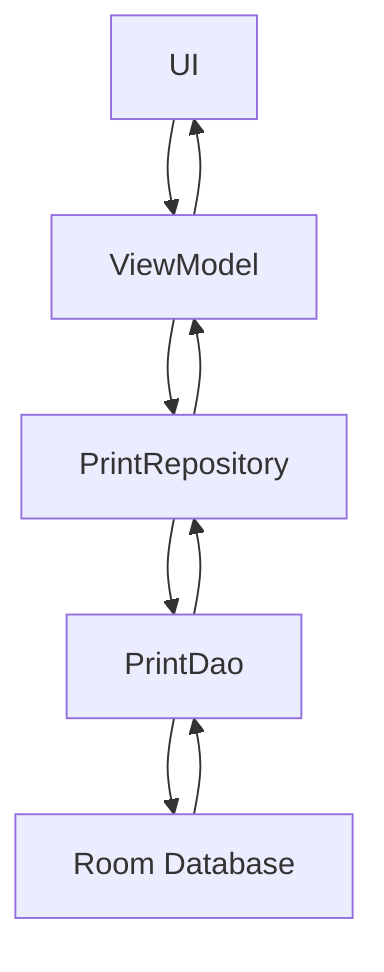
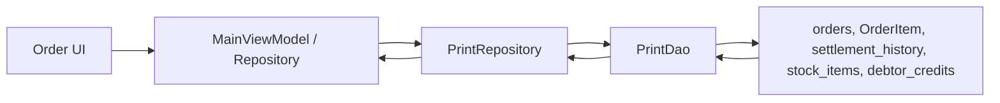
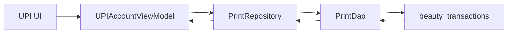
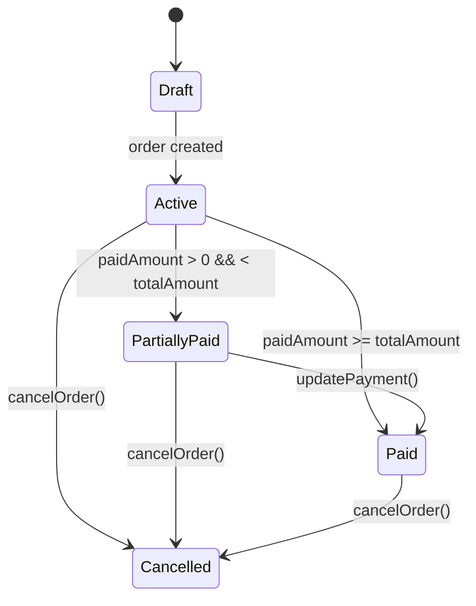
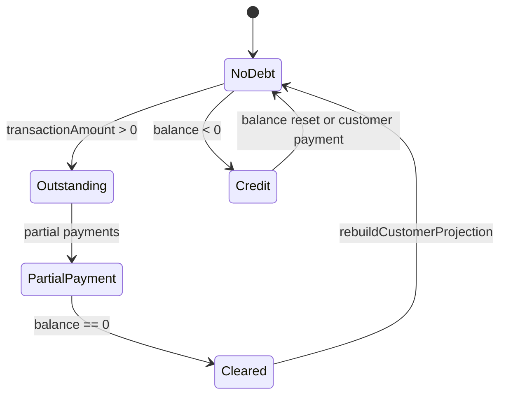
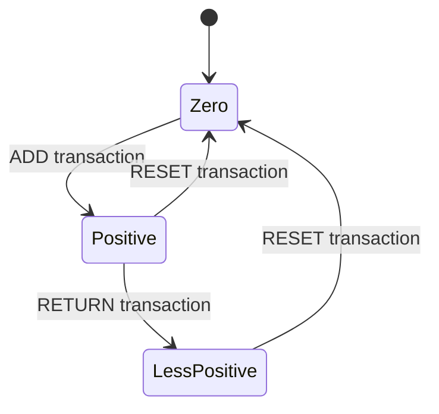

# Tadiwa Print Buddy Business Logic Audit

This document captures the implemented business logic in the current repository without modifying any code. It is derived from Activities, ViewModels, repository methods, DAO methods, entities, workers, adapters, and relevant UI flow.

---

## 1. Orders

### Purpose
Track print orders, payments, and customer balances. Orders may be paid in cash, UPI, or deferred credit. All orders are recorded with customer linking and settlement history to support debtor tracking.

### Entry Points
- `MainActivity` through `MainViewModel.completeOrder()`
- `CartActivity` through `PrintRepository.confirmOrder()`
- `OrderDetailsActivity` through `PrintRepository.updatePayment()`
- `MainViewModel` internal flows for UI state validation

### Execution Flow
1. User clicks a complete order action in `MainActivity` or `CartActivity`
2. `MainViewModel.completeOrder()` or `CartActivity.saveOrderAndShowPayment()` builds a `CartItem` list
3. `PrintRepository.confirmOrder()` validates cart and customer input
4. `PrintRepository.confirmOrder()` checks stock via `PrintDao.getStockItemByName()` and `check currentQuantity`
5. If stock sufficient, `getOrCreateCustomer()` ensures a `CustomerEntity` exists
6. `PrintRepository` computes total, payment status, and balances
7. Creates `Order` and `OrderItem` objects
8. `PrintDao.recordOrderAtomic()` performs transaction:
   - deduct stock via `safeDeductStock()`
   - insert `orders`
   - insert `OrderItem`
   - insert `SettlementHistory` if transaction amount != 0
   - rebuild customer projection
9. If payment method is `UPI`, `PrintRepository.insertBeautyTransaction()` records a beauty account transaction
10. `MainViewModel` or `CartActivity` responds based on success or error

### Database Tables Affected
- `orders`
- `OrderItem`
- `settlement_history`
- `debtor_credits` (via `rebuildCustomerProjection`)
- `stock_items`
- `beauty_transactions` (when payment uses UPI)
- `customers`

### Reads
- `PrintDao.getCustomerByNormalizedName()` to find or create the customer
- `PrintDao.getStockItemByName()` to verify stock levels
- `PrintDao.getLatestBalanceForCustomer()` to compute previous balance
- `PrintDao.getUnpaidTotalForCustomer()` if no settlement exists

### Writes
- `insertOrder(order)` into `orders`
- `insertOrderItems(items)` into `OrderItem`
- `insertSettlement(settlement)` into `settlement_history`
- `insertOrUpdateDebtorCredit()` into `debtor_credits`
- `safeDeductStock(name, quantity)` updates `stock_items`
- `insertBeautyTransaction()` into `beauty_transactions` for UPI
- `insertCustomer()` into `customers` when customer is new

### Business Rules
- Cart must contain at least one item
- `total > 0`
- Each item must have `quantity > 0` and `price >= 0`
- Order credit status mapping:
  - `paymentMethod == OWES_ME` → `paymentMethod = NONE`, `paymentStatus = UNPAID`, `paidAmount = 0`
  - otherwise `paidAmount = total - appliedCredit`
  - `paymentStatus = PAID` when `paidAmount >= total`
  - `paymentStatus = PARTIALLY_PAID` when `paidAmount > 0 && paidAmount < total`
  - `paymentStatus = UNPAID` when `paidAmount == 0`
- Customer balance updates by `transactionAmount` = `total - paidAmount`
- `newBalance = previousBalance + transactionAmount`
- `SettlementHistory` entries are created for every non-zero transaction amount and payment/cancel actions
- `OrderStatus` is `ACTIVE` by default, turns `CANCELLED` on cancel
- UPI payments create `BeautyTransaction` entries of type `ADD`
- Cancelled orders restore stock and create `BeautyTransaction` of type `RETURN` if paid via UPI

### Side Effects
- Stock deduction or restoration
- Customer projection rebuilds into `debtor_credits`
- Beauty account transaction insertion
- Settlement history entry insertion
- UI state events and toast messages

### Dependencies
- `MainActivity`
- `CartActivity`
- `MainViewModel`
- `PrintRepository`
- `PrintDao`
- `AppDatabase`
- `Order`
- `OrderItem`
- `CustomerEntity`
- `SettlementHistory`
- `DebtorCredit`
- `BeautyTransaction`
- `StockItem`
- `PaymentBottomSheet`
- `PaymentDialogFragment`

### Assumptions
- Customer display name uniquely identifies the customer after normalization
- Stock item names match `serviceName` exactly
- `Order.transactionAmount` is always the amount customer owes after payment
- `SettlementHistory.newBalance` and `remainingBalance` are snapshots, not authoritative reconcilers
- `UPI` payments are considered direct pay and should also affect the beauty account

### Failure Conditions
- Validation failure returns `OrderResult.ValidationError`
- Insufficient stock returns `OrderResult.InsufficientStock`
- Database transaction failure triggers `OrderResult.Error`
- Duplicate customer names are prevented by `normalizedName` unique index
- `safeDeductStock()` fails if stock is insufficient, throwing an exception inside transaction
- Payment update with zero or negative delta is ignored

---

## 2. Payment Updates

### Purpose
Add additional payment to an existing order, update customer balance and record a settlement event.

### Entry Points
- `OrderDetailsActivity.processCashPayment()`
- `OrderDetailsActivity.showPaymentQr()`
- `DebtActivity.showUpdatePaymentDialog()`
- `CartActivity` after order saved with QR dialog

### Execution Flow
1. User chooses payment for unpaid portion of order
2. `repository.updatePayment(orderId, newPaidAmount, paymentMethod)` called
3. `PrintRepository.updatePayment()` loads the order
4. Delta computed: `newPaidAmount - order.paidAmount`
5. If delta <= 0, function returns early
6. Determine `status` based on `newPaidAmount`
7. Determine `method`:
   - if existing method is `NONE` or empty, set to provided `paymentMethod`
   - if existing method equals provided, keep it
   - else set `MIXED`
8. Recompute customer balance and settlement entry
9. `PrintDao.recordPaymentAtomic()` updates order payment and inserts a settlement history entry, rebuilds customer projection
10. For UPI, insert `BeautyTransaction` of type `ADD`

### Database Tables Affected
- `orders`
- `settlement_history`
- `debtor_credits`
- `beauty_transactions` (if UPI)

### Reads
- `orders` row by `orderId`
- customer balance projection via `getCustomerBalanceById()` and latest `settlement_history`

### Writes
- `orders.paidAmount`
- `orders.paymentStatus`
- `orders.paymentMethod`
- `settlement_history`
- `debtor_credits` via rebuild projection
- `beauty_transactions` for UPI

### Business Rules
- `newPaidAmount` must be greater than existing `paidAmount`
- `paymentMethod` becomes `MIXED` if order already had a different method
- A payment of `UPI` is treated as beauty account addition
- Customer balance decreases by `delta`

### Side Effects
- Settlement history creation
- Customer projection rebuild
- Beauty account addition for UPI

### Dependencies
- `PrintRepository`
- `PrintDao`
- `Order`
- `SettlementHistory`
- `BeautyTransaction`

### Assumptions
- Existing order status and payment method reflect prior actions accurately
- Negative or zero payment changes are invalid and ignored

### Failure Conditions
- Missing order aborts silently
- `recordPaymentAtomic()` transaction failure may leave order and settlement unsynced if database errors occur

---

## 3. Order Cancellation

### Purpose
Cancel an order, restore stock, adjust customer balance, and log cancellation settlement.

### Entry Points
- no explicit UI entry found in Activities (likely planned but not present in main UI)
- `PrintRepository.deleteOrder()` calls `cancelOrder()` first

### Execution Flow
1. `PrintRepository.cancelOrder(orderId)` retrieves order
2. Skip if already `CANCELLED`
3. Compute reverse debt: `order.totalAmount - order.paidAmount`
4. New balance = currentBalance - reverseDebt
5. Create `SettlementHistory` with `type = CANCEL`, `ledgerEntryType = ORDER_CANCEL`, `transactionAmount = -reverseDebt`
6. `PrintDao.cancelOrderAtomic()` restores stock, updates order status, inserts settlement, rebuilds projection
7. If paid via UPI, insert beauty `RETURN` transaction

### Database Tables Affected
- `orders`
- `OrderItem` through foreign key cascade if order deleted later
- `stock_items`
- `settlement_history`
- `debtor_credits`
- `beauty_transactions` (for UPI)

### Writes
- `updateOrderStatus(orderId, CANCELLED)`
- `restoreStock(serviceName, quantity)`
- `insertSettlement()`
- `insertBeautyTransaction()` if UPI
- `insertOrUpdateDebtorCredit()` after rebuild

### Business Rules
- Cancel only if order is active
- Cancellation reverses outstanding debt only, not paid amount
- UPI paid amount becomes beauty account return

### Assumptions
- Stock restore is permitted and inventory is tracked for every printed item serviceName
- Orders can be cancelled after they exist

### Failure Conditions
- Missing order aborts silently
- Transaction failure during restore or status update may leave inventory inconsistent

---

## 4. Debt & Customer Ledger

### Purpose
Track customers who owe money (`OWES ME`) or have credit balances, expose debtor summaries, and allow paying down outstanding orders.

### Entry Points
- `DebtorCreditActivity` displays debtor credits and allows deletion
- `DebtActivity` allows updating payment on unpaid orders
- `SettlementHistoryActivity` shows ledger history
- `PrintRepository.applyPaymentToCustomer()` and `applyPaymentToCustomerId()` for settling across orders
- `MainViewModel` uses `repository.getCustomerBalance()` when user enters customer name

### Execution Flow
1. Balances are calculated from either latest settlement or unpaid order total
2. `rebuildCustomerProjection(customerId)` keeps `debtor_credits` synchronized with customer balance
3. Payment to customer can be applied to oldest unpaid orders first inside `applyPaymentToCustomerIdAtomic()`
4. Settlement history entries inserted for payments and adjustments
5. `DebtorCreditActivity` loads from `printDao.getDebtorCreditList()` and filters

### Database Tables Affected
- `debtor_credits`
- `settlement_history`
- `orders`
- `customers`

### Business Rules
- Debtor balance is authoritative from latest `settlement_history.newBalance` or unpaid orders
- Customer projection is updated whenever orders or settlements change
- Payment is applied oldest-first to unpaid orders
- `paymentMethod` becomes `MIXED` if a payment differs from existing order method
- `DebtorCredit` amount > 0 means customer owes the business; amount < 0 means the business owes customer (credit available)

### Side Effects
- Customer deletion removes orders, settlements, and debtor credit
- Export of debtor list to CSV

### Dependencies
- `PrintRepository`
- `PrintDao`
- `DebtorCredit`
- `SettlementHistory`
- `CustomerEntity`

### Assumptions
- `settlement_history` is maintained correctly and can be used to rebuild projection
- Customer data and name normalization are stable

### Failure Conditions
- `verifyCustomerBalance()` is a broken query because it compares identical sets; it may always be true
- Deleting customers removes all financial history and may impair audit trails

---

## 5. Settlement History

### Purpose
Display exportable ledger history for customers and support restore/merge of settlement data.

### Entry Points
- `SettlementHistoryActivity` uses `SettlementHistoryViewModel`
- Export/restore actions in the activity

### Execution Flow
1. `SettlementHistoryViewModel.loadSettlements()` fetches all settlement history
2. UI groups transactions by customer and toggles expansion
3. Export uses raw `getAllSettlements()` result and writes CSV/JSON
4. Restore merges or replaces history via `PrintRepository.restoreSettlements()`

### Database Tables Affected
- `settlement_history`
- Possibly `debtor_credits` if restore triggers rebuild afterward indirectly

### Business Rules
- Merge mode appends settlement entries
- Replace mode clears settlement history and inserts restored entries
- The UI derives labels by ledger entry type and transaction sign
- There is no explicit integrity check before restore

### Assumptions
- Restored data is consistent and can be resumed without further reconciliation
- `SettlementHistory` fields are sufficient for ledger display

### Failure Conditions
- Invalid JSON or empty restore file is rejected
- If restore replaces data, current state may become inconsistent with remaining orders and customer projection

---

## 6. UPI Account (formerly Beauty Account)

### Purpose
Track external digital money flows (UPI) in a separate ledger, including UPI order receipts and manual adjustments.

### Entry Points
- `BeautyAccountActivity` and `BeautyAccountViewModel`
- `PrintRepository.insertBeautyTransaction()` from orders, payments, expenses, debt settlements
- `PrintRepository.reconcileBeautyAccount()`

### Execution Flow
1. `BeautyAccountViewModel` chooses a time period and queries `PrintDao.getFilteredBeautyTransactions()` to populate UI
2. Summary values are computed from receipts, returns, net flow, and transaction count
3. When adding/returning money, `repository.insertBeautyTransaction(amount, type, note)` is called
4. `PrintRepository.insertBeautyTransaction()` uses current balance and transaction type to compute transaction amount and new balance
5. `deleteBeautyTransaction()` removes a row then reconciles all transactions chronologically

### Database Tables Affected
- `beauty_transactions`

### Business Rules
- `ADD` increases balance by `amount`
- `RETURN` decreases balance by `amount`
- `RESET` zeroes the balance by setting `transactionAmount = -previousBalance` and `newBalance = 0`
- Reconciliation recalculates `previousBalance`, `transactionAmount`, and `newBalance` in timestamp order
- Beauty balance is authoritative from latest `newBalance`

### Side Effects
- Expense entries with UPI cause beauty returns
- UPI order and payment receipts add to beauty account
- Deletion triggers full ledger rebuild

### Assumptions
- Beauty account is an external ledger separate from business sales and expenses
- `BeautyTransaction` chronology is available and sufficient for balance reconstruction

### Failure Conditions
- Missing transactions cause reconciliation gaps
- `RESET` entries may distort historical ledger if repeated
- Deletion may remove audit trail and require rebuild

---

## 7. Expenses

### Purpose
Track cash and UPI expenses to compute net profit and support exports/restores.

### Entry Points
- `ExpenseActivity` UI for adding and deleting expenses
- `PrintRepository.addExpense()` and `insertExpense()`

### Execution Flow
1. User adds expense with amount, category, note, and method
2. `PrintRepository.addExpense()` normalizes category and calls `insertExpense`
3. `PrintRepository.insertExpense()` writes `Expense` and if `paymentMethod == UPI` records a beauty account `RETURN`
4. Expense list is observed via `getAllExpensesFlow()` in the UI

### Database Tables Affected
- `expenses`
- `beauty_transactions` for UPI expense payments

### Business Rules
- Expense amount must be > 0 and category non-blank
- Payment method may be `CASH` or `UPI`
- `UPI` expenses are treated as money returned from the beauty account

### Side Effects
- Beauty return transaction created for UPI expenses
- Total expenses flow through dashboard/trend queries

### Assumptions
- Expense categories map to defined enum values, defaulting to `MISCELLANEOUS`

### Failure Conditions
- Add with invalid input is prevented at UI level only
- Delete expense does not reconcile beauty account after deletion

---

## 8. Inventory

### Purpose
Track stock items and enforce inventory deductions on orders.

### Entry Points
- `InventoryActivity` add/edit/delete stock items
- `PrintRepository.confirmOrder()` via `PrintDao.recordOrderAtomic()` stock deduction

### Execution Flow
1. Inventory items are stored in `stock_items`
2. `confirmOrder()` uses `PrintDao.getStockItemByName()` to validate quantities
3. `recordOrderAtomic()` calls `safeDeductStock()` in a transaction
4. `cancelOrderAtomic()` restores stock when cancelling orders

### Database Tables Affected
- `stock_items`

### Business Rules
- Stock deduction is conditional on `currentQuantity >= quantity`
- Stock restoration occurs only during order cancel
- Low stock is determined by `currentQuantity <= lowStockThreshold`

### Failure Conditions
- No stock item record means no stock check, allowing unlimited sales
- `safeDeductStock()` returns 0 if insufficient stock, aborting transaction

---

## 9. Dashboard & Analytics

### Purpose
Present revenue, sales, expense, debtor, and beauty account analytics.

### Entry Points
- `DashboardActivity` and `DashboardViewModel`

### Execution Flow
1. Dashboard fetches totals/metrics via repository methods
2. Methods call DAO range queries for revenue, expenses, counts, and breakdowns
3. `DashboardActivity` renders charts and labels based on returned values

### Database Tables Affected
- `orders`
- `settlement_history`
- `expenses`
- `beauty_transactions`
- `OrderItem`

### Business Rules
- `getRevenueBetween()` sums `paidAmount` for active orders
- `getSalesRevenueBetween()` excludes `paymentMethod='NONE'`
- `getSettledDebtRevenueBetween()` sums `settledAmount` for `ledgerEntryType='PAYMENT'`
- Payment breakdown groups by `paymentMethod`
- Service breakdown groups by `serviceName`

### Assumptions
- `paidAmount` equals realized revenue in sales queries
- `paymentMethod='NONE'` identifies credit orders
- `settlement_history` payment entries represent debt collections

### Failure Conditions
- Orders with `paymentMethod='MIXED'` may be misclassified in payment method queries
- `settledAmount` can be inconsistent with `transactionAmount` semantics

---

## 10. Backups and Restore

### Purpose
Export and restore settlement or expense data via JSON or CSV.

### Entry Points
- `SettlementHistoryActivity` restore/export
- `ExpenseActivity` restore/export
- `DebtorCreditActivity` export

### Execution Flow
1. UI selects a file and chooses merge or replace
2. Raw JSON is parsed and passed to repository restore methods
3. Repository optionally clears data and then inserts rows

### Database Tables Affected
- `settlement_history`
- `expenses`

### Business Rules
- Replace mode clears table before insert
- Merge mode simply inserts rows alongside existing data
- No validation exists to reconcile restored data with order or customer state

### Failure Conditions
- Import invalid file results in user-facing error only
- Replace can orphan old order/customer/debtor data

---

## 11. Security & Authentication

### Purpose
Protect access to app settings or features using biometrics and password fallback.

### Entry Points
- `SecurityActivity`
- `TadiwaPrintBuddyApp` lifecycle callback for background lock

### Execution Flow
1. `SecurityActivity` requests biometric or password authentication
2. `SecurityManager` wraps biometric prompt and fallback
3. `TadiwaPrintBuddyApp` locks the app on stop/pause depending on lifecycle

### Note
No deep business logic is implemented here beyond app access control.

---

## 12. Printer References

### Purpose
Store scanned or referenced printer details.

### Entry Points
- `PrinterReferenceActivity`
- `PrinterReferenceAdapter`

### Execution Flow
1. User adds or deletes printer references
2. `PrintRepository.addPrinterReference()` inserts row
3. `PrintRepository.getAllPrinterReferences()` loads list

### Database Tables Affected
- `printer_references`

### Business Rules
- No specific validation beyond required fields appears in code

---

## Sequence Diagrams

### Order Creation

### Payment Update

### Debt Payment Walkthrough

### Beauty Account Transaction

---

## Data Flow Diagrams

### General UI to Room Flow

### Order and Payment Flow

### UPI Account Flow

---

## State Machines

### Order State

### Customer Debt State

### Beauty Account State

---

## Dependency Map

### Order Feature
- `MainActivity`
- `CartActivity`
- `MainViewModel`
- `PrintRepository.confirmOrder()`
- `PrintDao.recordOrderAtomic()`
- `orders`
- `OrderItem`
- `settlement_history`
- `stock_items`
- `customers`
- `debtor_credits`
- `beauty_transactions`

### Payment Update
- `OrderDetailsActivity`
- `DebtActivity`
- `PrintRepository.updatePayment()`
- `PrintDao.recordPaymentAtomic()`
- `orders`
- `settlement_history`
- `debtor_credits`
- `beauty_transactions`

### Beauty Account
- `BeautyAccountActivity`
- `BeautyAccountViewModel`
- `PrintRepository.insertBeautyTransaction()`
- `PrintDao.insertBeautyTransaction()`
- `beauty_transactions`

### Expenses
- `ExpenseActivity`
- `PrintRepository.addExpense()`
- `PrintDao.insertExpense()`
- `expenses`
- `beauty_transactions`

### Inventory
- `InventoryActivity`
- `PrintRepository.confirmOrder()`
- `PrintDao.safeDeductStock()`
- `stock_items`

---

## Business Rule Index

| Rule ID | Implemented In |
|---|---|
| R01 | `PrintRepository.confirmOrder()` |
| R02 | `PrintRepository.updatePayment()` |
| R03 | `PrintRepository.cancelOrder()` |
| R04 | `PrintRepository.applyPaymentToCustomerIdAtomic()` |
| R05 | `PrintRepository.insertBeautyTransaction()` |
| R06 | `PrintRepository.addExpense()` |
| R07 | `PrintDao.recordOrderAtomic()` |
| R08 | `PrintDao.cancelOrderAtomic()` |
| R09 | `PrintRepository.getCustomerBalanceById()` |
| R10 | `MainViewModel.calculateTotals()` |

---

## Logic Gap Report

| Expected behavior | Actual implementation | Risk | Recommended fix |
|---|---|---|---|
| Credit order should set existing outstanding balance if customer exists | `MainViewModel` considers negative balance as available credit only, not positive outstanding debt when calculating `creditUsed` | Underestimates customer debt effects on credit usage | Clarify whether positive balance means customer owes or credit available; centralize balance sign semantics |
| E-commerce UPI payment should confirm by actual callback | `PaymentDialogFragment` marks paid on user action only | Manual mark-as-paid could desynchronize payment state | Add server/callback verification or explicit success flag |
| Expense delete does not adjust beauty ledger | `deleteExpense()` simply removes expense row | UPI expense deletion leaves beauty account inconsistent | Reconcile beauty account after expense deletion |
| Restore settlement history does not rebuild customer projections | `restoreSettlements()` may insert history without sync to `debtor_credits` | Customer balances may be stale | Rebuild projections after restore |
| Customer deletion removes all order and settlement data without archiving | `deleteCustomerCompletely()` deletes orders and history | Loss of audit trail, data integrity risk | Implement soft-delete or archival policy |

---

## Contradictory Logic

- `paymentMethod = CASH` with `paidAmount = 0` is converted to `NONE` in migration and in `confirmOrder()` credit path, but some legacy data may still use `CASH` for unpaid orders.
- `SettlementHistory.remainingBalance` and `newBalance` are both snapshots; code treats them interchangeably in display logic.
- `PrintDao.getSettledDebtRevenueBetween()` sums `settledAmount`, while `PrintRepository` may use `transactionAmount` negatives elsewhere for debt payments.
- `MainViewModel` uses `customerName` balance lookup but does not validate normalization for customer identity beyond lowercase trim.
- `applyPaymentToCustomerIdAtomic()` computes `newBalance = currentBalance - paymentAmount`, while `recordPaymentAtomic()` derives `balanceAfter = newBalance`; risk of mismatch when currentBalance was not from latest settlement.

---

## Duplicated Logic

- Payment status calculation appears in `PrintRepository.confirmOrder()`, `PrintRepository.updatePayment()`, and `PrintRepository.reconcileAll()`.
- Beauty account transaction insert logic occurs in `PrintRepository.confirmOrder()`, `updatePayment()`, `cancelOrder()`, `addExpense()`, and `applyPaymentToCustomerId()`.
- Balance projection rebuild is called from multiple repository methods instead of a single lifecycle-aware handler.
- Customer creation via normalized name exists only in repository but UI uses raw strings; normalization logic is duplicated in `MainViewModel` and `PrintRepository`.

---

## Dangerous Assumptions

- Customers with the same normalized name are the same person.
- Stock items are matched by serviceName string without a service-to-inventory mapping.
- `paidAmount` always reflects actual cash/UPI received.
- `SettlementHistory.newBalance` is authoritative for customer balance.
- `BeautyTransaction` type logic is fully deterministic from `type` alone.
- Deleting customer history is safe and complete.
- Export/restore operations are trusted without schema or data validation.

---

## High-Risk Financial Operations

- `PrintRepository.confirmOrder()` order creation with credit and UPI logic
- `PrintRepository.updatePayment()` payments affecting order status and balance
- `PrintRepository.cancelOrder()` reversing order debt
- `PrintRepository.applyPaymentToCustomerIdAtomic()` applying payments to oldest orders
- `PrintRepository.insertBeautyTransaction()` interacting with beauty account balances
- `PrintRepository.addExpense()` UPI expense returns affecting external ledger
- Restore operations in `SettlementHistoryActivity` and `ExpenseActivity`

---

## Notes
- No code modifications have been made.
- The audit is based on the active repository code and UI entry points.
- Further validation should compare this document with actual UI flows in `activity_*.xml` and unexamined adapters if needed.
